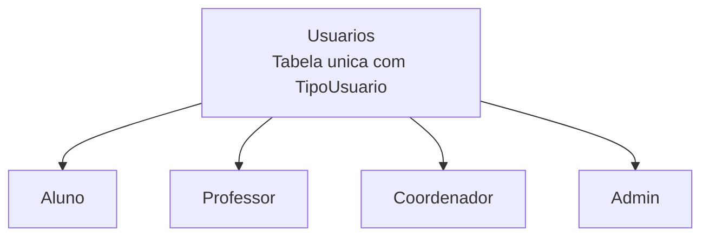
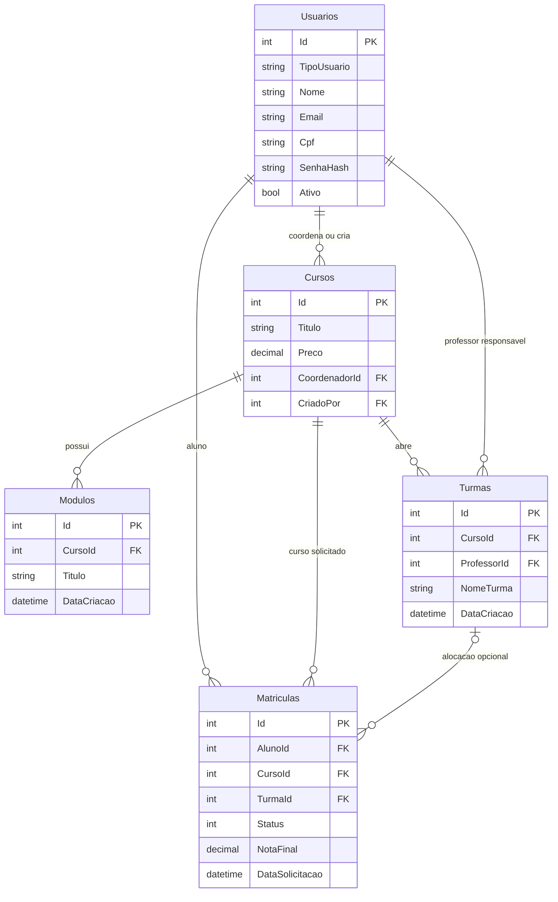
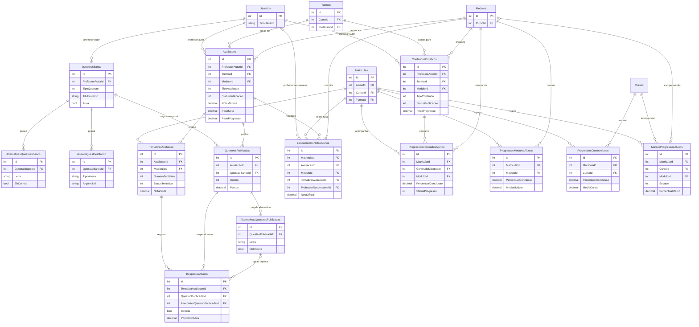

# Diagrama do Banco para Apresentacao

Atualizado em: 2026-04-15

## Objetivo

Este arquivo resume como o banco esta organizado hoje no projeto `Sistema Academico Integrado`, com foco em:

- identidade e perfis
- estrutura academica
- publicacao de conteudo e avaliacoes
- notas e progresso do aluno

## Ponto estrutural principal

O projeto usa heranca TPH (table-per-hierarchy) para usuarios. Na pratica, `Aluno`, `Professor`, `Coordenador` e `Admin` vivem fisicamente na tabela `Usuarios`, diferenciados pela coluna `TipoUsuario`.

## Diagrama 1 - Perfis e estrutura academica

## Diagrama 2 - Nucleo pedagogico, notas e progresso

## Como explicar o banco na apresentacao

1. O cadastro de acesso parte de `Usuarios`, usando `TipoUsuario` para separar aluno, professor, coordenador e admin na mesma tabela fisica.
2. `Cursos` definem o catalogo principal. Cada curso pode ter um coordenador responsavel e um admin criador.
3. `Modulos` organizam o conteudo interno de cada curso.
4. `Turmas` representam a oferta operacional do curso e ligam o curso a um professor responsavel.
5. `Matriculas` conectam o aluno ao curso e, quando houver alocacao, tambem a uma turma especifica.
6. O professor publica `ConteudosDidaticos` e `Avaliacoes` sempre no contexto de uma turma e de um modulo.
7. O banco de questoes fica em `QuestoesBanco`, com alternativas e anexos reutilizaveis. Quando uma avaliacao e montada, as questoes entram em `QuestoesPublicadas` para congelar o snapshot usado naquela prova ou quiz.
8. O aluno realiza a avaliacao por meio de `TentativasAvaliacao`, e cada resposta fica em `RespostasAlunos`.
9. A nota oficial consolidada da avaliacao fica em `LancamentosNotasAlunos`.
10. O acompanhamento pedagogico fica espalhado em tres niveis: `ProgressosConteudosAlunos`, `ProgressosModulosAlunos` e `ProgressosCursosAlunos`, com `MarcosProgressosAlunos` registrando eventos relevantes de avancos percentuais.

## Regras de integridade importantes

- `Usuarios` concentra todos os perfis. As regras de papel dependem da aplicacao e do valor de `TipoUsuario`.
- `Turmas` possuem indice unico por `NomeTurma + CursoId`.
- `Modulos` possuem indice unico por `CursoId + Titulo`.
- `AlternativasQuestoesBanco` possuem indice unico por `QuestaoBancoId + Letra`.
- `AlternativasQuestoesPublicadas` possuem indice unico por `QuestaoPublicadaId + Letra`.
- `QuestoesPublicadas` possuem indice unico por `AvaliacaoId + Ordem`.
- `TentativasAvaliacao` possuem indice unico por `MatriculaId + AvaliacaoId + NumeroTentativa`.
- `RespostasAlunos` possuem indice unico por `TentativaAvaliacaoId + QuestaoPublicadaId`.
- `LancamentosNotasAlunos` possuem indice unico por `MatriculaId + AvaliacaoId`.
- `ProgressosConteudosAlunos` possuem indice unico por `MatriculaId + ConteudoDidaticoId`.
- `ProgressosModulosAlunos` possuem indice unico por `MatriculaId + ModuloId`.
- `ProgressosCursosAlunos` possuem indice unico por `MatriculaId + CursoId`.

## Observacoes sobre delete behavior

- O projeto usa uma combinacao de `Cascade` e `Restrict` para evitar `multiple cascade paths` no SQL Server.
- `Matricula -> Turma` usa `Restrict`.
- `ConteudoDidatico -> Modulo` usa `Restrict`, enquanto `ConteudoDidatico -> Turma` usa `Cascade`.
- `Avaliacao -> Modulo` usa `Restrict`, enquanto `Avaliacao -> Turma` usa `Cascade`.
- `TentativaAvaliacao -> Matricula` usa `Restrict`.
- `ProgressoConteudoAluno -> Matricula` usa `Restrict`.

## Roteiro curto para apresentacao

1. Comece pela tabela `Usuarios`, explicando que todos os perfis vivem na mesma base e sao diferenciados por `TipoUsuario`.
2. Mostre que `Cursos`, `Modulos` e `Turmas` formam a estrutura academica principal.
3. Explique que `Matriculas` e a tabela que conecta o aluno ao curso e, quando necessario, a uma turma.
4. Mostre que o professor publica `ConteudosDidaticos` e `Avaliacoes` sempre ligados a `Turma` e `Modulo`.
5. Feche com a jornada do aluno: `TentativasAvaliacao`, `RespostasAlunos`, `LancamentosNotasAlunos` e as tabelas de progresso.
